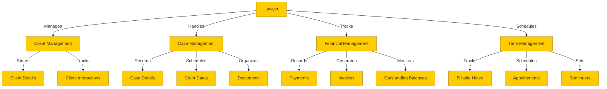
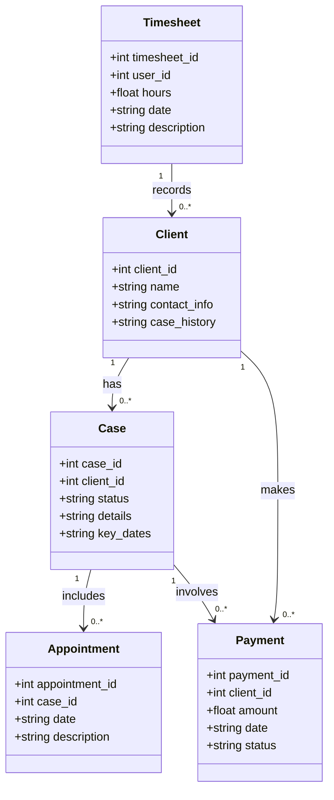
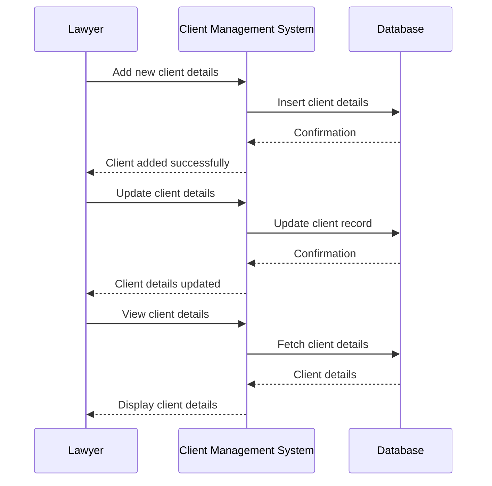
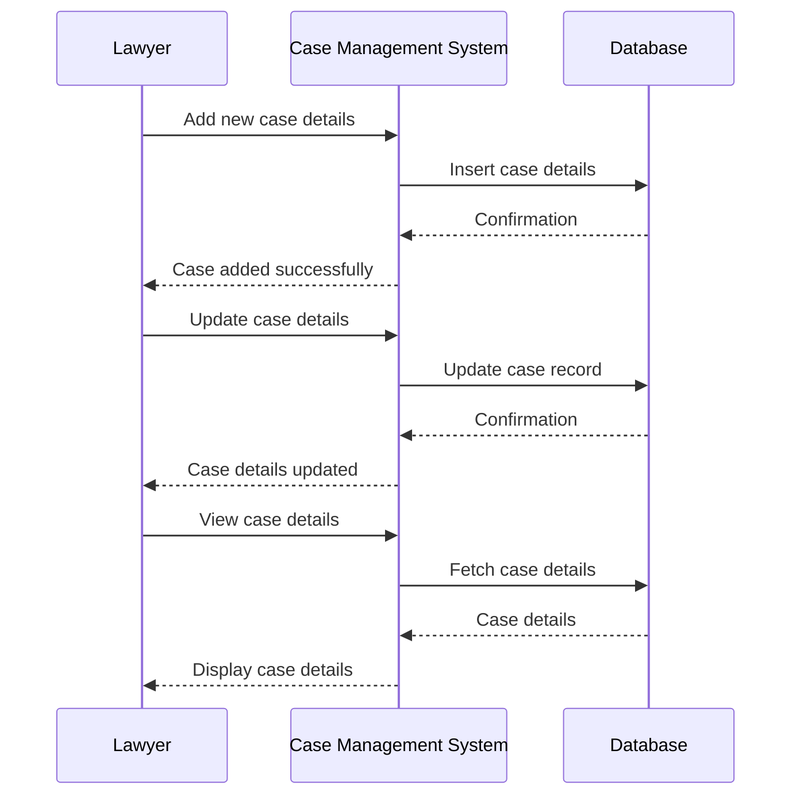
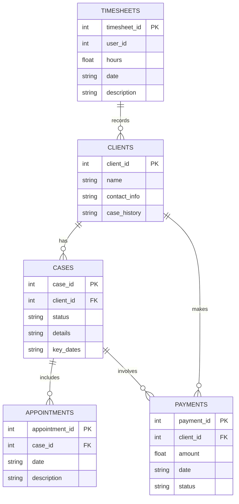

# Detailed Design Document

## Project Title
Development of Web and Mobile App for Legal Practice Management

## Overview
This document provides a detailed design for the development of a web and mobile application to assist lawyers in managing their practice. It includes UML and ER diagrams, as well as detailed specifications for the user interface. The aim is to clarify the developers' understanding and their parts so they can write code effectively.

## Table of Contents
1. System Architecture
2. UML Diagrams
   - Use Case Diagram
   - Class Diagram
   - Sequence Diagrams
3. ER Diagram
4. User Interface Specifications
   - Web Application
   - Mobile Application
5. Component Design
6. Approval and Next Steps

## System Architecture
### Frontend
- **Web Application**: React.js
- **Mobile Application**: React Native

### Backend
- **Server**: Node.js with Express.js framework
- **Database**: SQLite database (only for release 1)

### Security
- **Encryption**: SSL/TLS for data in transit, AES-256 for data at rest
- **Authentication**: OAuth 2.0, JWT (JSON Web Tokens) for session management

## UML Diagrams
### Use Case Diagram

### Class Diagram

### Sequence Diagrams
#### Client Management

#### Case Management

## ER Diagram

## User Interface Specifications
### Web Application
#### Dashboard
- **Description**: Overview of key metrics and recent activities.
- **Components**: Charts, recent activities list, notifications.

#### Client Management
- **Description**: Interface to add, edit, and view client details.
- **Components**: Client list, client detail form, search bar.

#### Case Management
- **Description**: Interface to manage case details and documents.
- **Components**: Case list, case detail form, document upload.

#### Financial Management
- **Description**: Interface to track payments and generate invoices.
- **Components**: Payment list, invoice generation form, payment status.

#### Time Management
- **Description**: Interface to track billable hours and manage appointments.
- **Components**: Timesheet, appointment scheduler, reminders.

### Mobile Application
#### Dashboard
- **Description**: Overview of key metrics and recent activities.
- **Components**: Charts, recent activities list, notifications.

#### Client Management
- **Description**: Mobile-friendly interface to manage client details.
- **Components**: Client list, client detail form, search bar.

#### Case Management
- **Description**: Mobile-friendly interface to manage case details.
- **Components**: Case list, case detail form, document upload.

#### Financial Management
- **Description**: Mobile-friendly interface to track payments.
- **Components**: Payment list, invoice generation form, payment status.

#### Time Management
- **Description**: Mobile-friendly interface to track billable hours.
- **Components**: Timesheet, appointment scheduler, reminders.

## Component Design
### Frontend Components
- **Header**: Navigation bar with links to different sections.
- **Footer**: Footer with contact information and links.
- **Sidebar**: Sidebar for quick navigation.
- **Forms**: Reusable form components for client, case, and payment details.

### Backend Components
- **API Endpoints**: RESTful API endpoints for client, case, appointment, and payment management.
- **Database Models**: Models for Clients, Cases, Appointments, Payments, and Timesheets.
- **Authentication**: OAuth 2.0 and JWT for secure authentication and authorization.

## Next Steps
- Kickoff current sprent development
- Update the document with next version for future sprent

---

**Prepared by:**
[Development Team Lead's Name]  
[Development Team's Contact Information]

**Date:**
[Current Date]
